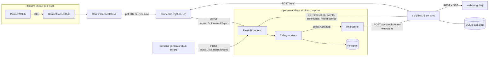
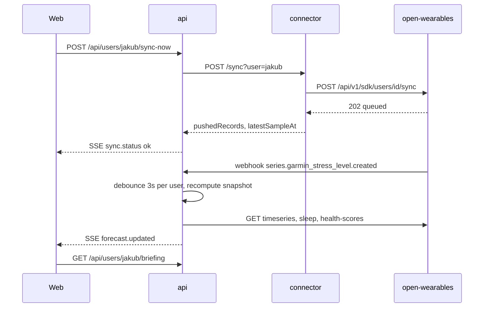

# Headroom - architecture

Companion to `happy-path.md`. Everything here exists to make that demo real, correct and defensible. Built during HackYeah 2026 on top of [open-wearables](https://github.com/the-momentum/open-wearables) (MIT).

## 1. Goals and non-goals

**Goals**

- Real, near-live Garmin data flowing through open-wearables into the app (about 1 minute after the watch syncs to the phone).
- An explainable engine: every number on screen can be traced to a formula and to the user's own data.
- A deterministic synthetic persona whose injected ground truth the engine must recover (our validation story).
- open-wearables is the single source of truth for health data; our app owns only calendar, reflections, accepted actions and computed snapshots.

**Non-goals (hackathon scope)**

- Authentication and multi-tenancy (single local deployment, user switcher instead of login).
- Real calendar OAuth (Google, Microsoft). Calendars are JSON files behind a `CalendarProvider` interface.
- A native mobile app. The web app is mobile-first and runs in the browser.
- Medical advice. The app gives wellbeing and training suggestions and says so.

## 2. System context



| Component | Tech | Port | Owns |
|---|---|---|---|
| open-wearables | FastAPI, Celery, Postgres, Redis, Svix (existing) | 8000 (API), 3000 (portal) | All health data, health scores, outgoing webhooks |
| connector | Python 3.12, `uv`, `garminconnect` | 8787 | Garmin Connect session, per-type sync cursor |
| persona generator | TypeScript, bun | - | Synthetic calendar and health data for Marta |
| api | NestJS on bun, Drizzle ORM, `bun:sqlite` | 3001 | Calendar, reflections, accepted actions, forecast snapshots, engine |
| web | Angular (latest stable), standalone components, signals, zoneless | 4200 | UI |

Why each choice:

- **NestJS + Angular**: Jakub's strongest stack, so every decision can be defended in front of the jury.
- **Python for the connector**: `garminconnect` is the best-maintained Garmin Connect client and it is the same language as open-wearables; the connector is small and isolated behind HTTP.
- **SQLite**: app-owned data is tiny and local; zero ops. Drizzle gives typed schema and migrations.
- **Server-Sent Events instead of WebSockets**: updates are one-way (server to browser); SSE is native in NestJS (`@Sse`) and in the browser (`EventSource`), with automatic reconnect.

## 3. open-wearables integration

### 3.1 Endpoints we use

All requests carry `X-Open-Wearables-API-Key`. The key lives only in the api and connector environments, never in the browser.

| Purpose | Endpoint | Caller |
|---|---|---|
| Create users (jakub, marta) | `POST /api/v1/users` | setup script |
| Push health data | `POST /api/v1/sdk/users/{user_id}/sync` | connector, persona generator |
| Read granular series | `GET /api/v1/users/{user_id}/timeseries?start_time&end_time&types=...&resolution=raw&cursor` | api |
| Sleep sessions | `GET /api/v1/users/{user_id}/events/sleep` | api |
| Workouts | `GET /api/v1/users/{user_id}/events/workouts` | api |
| Daily summaries | `GET /api/v1/users/{user_id}/summaries/sleep`, `/summaries/recovery` | api |
| Resilience and sleep scores | `GET /api/v1/users/{user_id}/health-scores` | api |
| Register webhook endpoint | `POST /api/v1/webhooks/endpoints`, secret via `GET /api/v1/webhooks/endpoints/{id}/secret` (developer JWT, not the API key) | setup script |

Series types read by the api: `heart_rate`, `garmin_stress_level`, `garmin_body_battery`, `steps`, `heart_rate_variability_rmssd`, `resting_heart_rate`.

TypeScript types for these responses are generated from `open-wearables/docs/openapi.json` with `openapi-typescript`, so a contract drift fails compilation instead of the demo.

### 3.2 Extension to open-wearables (small, upstreamable)

Problem: the SDK sync endpoint accepts HealthKit and Health Connect payloads only, and neither has a stress or Body Battery type. Those series exist in open-wearables (`SeriesType.garmin_stress_level`, `SeriesType.garmin_body_battery`) but can only arrive through the official Garmin cloud integration, whose developer program is closed to new sign-ups.

Change, on a fork branch `feat/sdk-garmin-wellness-metrics`:

1. `backend/app/constants/series_types/sdk/metric_types.py`: add
   - `SDKMetricType.GARMIN_STRESS_LEVEL = "GARMIN_STRESS_LEVEL"`
   - `SDKMetricType.GARMIN_BODY_BATTERY = "GARMIN_BODY_BATTERY"`
   and map them in `METRIC_TYPE_TO_SERIES_TYPE` to the existing series types. Because their identifiers do not start with `HK`, they automatically join `ANDROID_METRIC_TYPE_TO_SERIES_TYPE`, so `provider: "health_connect"` payloads can carry them with no other code change.
2. Tests in `backend/tests` covering the mapping and an end-to-end SDK import containing both new types.

Provenance stays explicit: every record pushed by the connector sets `source.name = "Garmin Connect (Headroom connector)"`, `source.deviceManufacturer = "Garmin"`, `source.deviceModel = <watch model>`; persona records set `source.name = "Headroom synthetic persona"`. Both are filterable through the `source` and `device_model` parameters of `/timeseries`.

Cleaner alternative if time allows (P1): register a dedicated `garmin_connect` SDK provider (`ProviderCapabilities(client_sdk=True)`) reusing the Health Connect import service, so data is labelled with its true provider.

### 3.3 Outgoing webhooks

- Enable with `OUTGOING_WEBHOOKS_ENABLED=true` in `backend/config/.env`.
- Subscribe the api to `series.heart_rate.created`, `series.garmin_stress_level.created`, `series.garmin_body_battery.created`, `series.heart_rate_variability_rmssd.created`, plus sleep and workout created events.
- Endpoint URL from the svix container: `http://host.docker.internal:3001/webhooks/open-wearables`.
- Signature: Svix headers `svix-id`, `svix-timestamp`, `svix-signature`, verified with the `svix` npm package; `svix-id` is the idempotency key.
- Large batches arrive as chunk events (`chunk_index`, `total_chunks`); we treat any chunk as a trigger and re-read from the API, so reassembly is not needed.

Verified in the spike (2026-10-04):

- Plain `http://` endpoint URLs are accepted by open-wearables.
- svix-server blocks private IPs by default (SSRF protection); `host.docker.internal` resolves to `192.168.65.254` on Docker Desktop, so deliveries failed with `response_code=0` until `SVIX_WHITELIST_SUBNETS="[192.168.65.0/24]"` was set. Only the Docker Desktop host-gateway subnet is allowed; SSRF protection stays on for everything else. The setting lives in `infra/open-wearables.override.yml`.
- A `POST /sdk/users/{id}/sync` with `provider: "health_connect"` heart-rate records produced a signed `series.heart_rate.created` delivery about 0.1 s after the Celery import finished. The SDK path emits outgoing webhooks, so the live path needs no polling.
- Managing webhook endpoints (`/api/v1/webhooks/*`) requires the developer JWT from `POST /api/v1/auth/login`; the API key is rejected there. Data endpoints use the API key.
- `INGEST_MODE=poll` stays as a fallback only.

## 4. connector (Python)

```
app/connector/
  pyproject.toml
  connector/
    garmin_client.py   # login with token cache (~/.garminconnect), MFA prompt on first run only
    mapper.py          # Garmin JSON -> open-wearables SDK payload (pure functions)
    ow_client.py       # POST /sdk/users/{id}/sync, chunked, retries with backoff
    state.py           # per-type cursor (last pushed sample timestamp), JSON file
    server.py          # POST /sync, GET /health
    main.py            # poll loop + CLI: backfill --days N
  tests/
    fixtures/          # recorded, anonymised Garmin responses
    test_mapper.py
```

Mapping (field names to confirm in the spike against real responses):

| Garmin Connect call | Data | SDK record |
|---|---|---|
| `get_heart_rates(date)` | `heartRateValues` `[ts_ms, bpm]`, about 2 min | `HEART_RATE` |
| `get_stress_data(date)` | `stressValuesArray` `[ts_ms, level]`, about 3 min; negative levels mean "not measurable" (off-wrist or motion) and are dropped | `GARMIN_STRESS_LEVEL` |
| `get_stress_data(date)` / `get_body_battery(...)` | Body Battery levels | `GARMIN_BODY_BATTERY` |
| `get_steps_data(date)` | 15-min step buckets | `STEP_COUNT` (Health Connect identifier) |
| `get_hrv_data(date)` | overnight `hrvReadings` (RMSSD) | `HEART_RATE_VARIABILITY` |
| `get_sleep_data(date)` | `sleepLevels` (deep, light, REM, awake) | `sleep` records with stages |
| `get_activities_by_date(...)` | activities | `workouts` |

Ground truth from Jakub's own device files (`docs/2026-09-29/*.fit`, one full day from a Garmin Connect export) confirms what the watch records: stress every 60 s with `-1` (not measurable) and `-2` (motion) flags, Body Battery in the same record (undocumented field 3 of message 227), heart rate every 1-2 min, sleep stages with a sleep score, and overnight HRV every 5 min plus Garmin's weekly average and baseline range. The connector's mapper tests must accept 60-second stress, not only the 3-minute resolution the official API documents.

Behaviour:

- **Poll loop**: every 60 s, fetch today and yesterday (late-arriving data), push only samples newer than the per-type cursor, then advance the cursor. Re-running never duplicates.
- **Sync now**: `POST /sync?user=jakub` runs one poll cycle immediately and returns `{ pushedRecords, latestSampleAt }`. A lock prevents overlapping cycles.
- **Backfill**: `uv run connector backfill --days 28` once before the demo; Garmin Connect has no one-month backfill limit like the official API.
- **Failure handling**: login or rate-limit failures are logged and surfaced through `GET /health` (`{ status, lastSuccessAt, lastError }`); the loop backs off exponentially up to 10 minutes and never crashes the process.

## 5. persona generator (TypeScript)

`app/api/scripts/generate-persona.ts`, run with `bun run persona:generate --seed 2026`.

- **Deterministic**: seeded PRNG (mulberry32); the same seed and anchor date always produce the same data.
- **Anchored to "today"**: history covers the previous 42 days; the future week starts tomorrow and tomorrow is the heavy day from `happy-path.md`.
- **Ground truth in one file**: `persona.truth.ts` holds the type loads, person effects, modifiers, reflections and training pattern from `happy-path.md`. Engine tests import the same file to assert recovery.
- **Signal model**, per minute, in Europe/Warsaw time:
  - Stress: a daily curve (asleep about 10, desk work about 25) + Gaussian noise (sd 4) + for each meeting with true load `L` a plateau of `0.4 * L` above baseline during the meeting and an exponential decay afterwards whose time-to-baseline is `0.5 * L` minutes. These constants invert the engine's load formula exactly (section 7.3), so a meeting generated with load `L` is measured as about `L`.
  - Heart rate: resting about 58, sedentary daytime about 68, + `0.25 * stress excess` bpm, + workout curves; sampled every 2 min.
  - Steps: 15-min buckets; walking between rooms before some meetings (to prove the sedentary filter works); runs on workout days.
  - Sleep: stage sequence per night; duration from the truth file; HRV per night = personal mean, scaled down 15% after "hard training before a heavy day".
  - Body Battery: charges during sleep in proportion to sleep quality, drains with stress and activity.
- **Outputs**: `app/api/data/calendars/marta.json` (past and future events, attendees, types, planned workouts, reflections) and SDK payloads pushed to open-wearables in chunks of 5,000 records.

## 6. api (NestJS)

### 6.1 Modules

```
app/api/src/
  config/            # @nestjs/config + zod schema; fails fast on missing env
  open-wearables/    # typed client (generated types), pagination, timeouts, retries
  calendar/          # CalendarProvider interface + JsonCalendarProvider
  engine/            # PURE TypeScript, no Nest imports; all math lives here
  forecast/          # orchestrates: load data -> engine -> snapshot -> emit
  ingest/            # webhook receiver (Svix verify), poll fallback, Sync now
  reflection/        # one-tap reflections
  actions/           # accept/dismiss recommended actions -> calendar blocks
  coach/             # P1: LLM phrasing with template fallback
  db/                # Drizzle schema + migrations (bun:sqlite)
```

`CalendarProvider` is the seam for production calendars:

```typescript
export interface CalendarProvider {
  events(userKey: UserKey, range: DateRange): Promise<readonly CalendarEvent[]>;
  addBlock(userKey: UserKey, block: NewCalendarBlock): Promise<CalendarEvent>;
}

export interface CalendarEvent {
  readonly id: string;
  readonly title: string;
  readonly kind: 'meeting' | 'workout' | 'block';
  readonly type?: MeetingType;        // explicit in the mock JSON; a classifier later
  readonly workoutIntensity?: 'easy' | 'tempo' | 'intervals' | 'long';
  readonly start: Date;
  readonly end: Date;
  readonly attendees: readonly PersonRef[];
  readonly source: 'calendar' | 'headroom';
}
```

In the hackathon build the mock calendar files stay read-only: accepted plan changes (a block, a moved workout, a sleep target) are stored in SQLite and merged over the calendar when the forecast is computed. A demo resets with `bun run db:reset`, and a real provider would write the same changes through `addBlock`.

### 6.2 Data flows

Live update:



- **Debounce**: chunked webhooks arrive in bursts; recomputation runs once per user, 3 s after the last event.
- **Poll fallback** (`INGEST_MODE=poll`): after Sync now returns, the api polls `/timeseries` for samples newer than `latestSampleAt` every 2 s for up to 60 s, then recomputes. A background poll every 60 s covers the connector's own loop.
- **Snapshot**: each recomputation stores a full JSON snapshot (briefing, week, energy map) in SQLite. Reads always serve the latest snapshot, so the UI never waits on open-wearables and survives it being down (marked `stale` when older than 15 min).

### 6.3 REST and SSE contract

| Method | Path | Body / response |
|---|---|---|
| GET | `/api/users` | `[{ key, displayName, isSynthetic, live }]` |
| GET | `/api/users/:key/briefing` | `{ capacity, tomorrow: { dayLoad, meetings[] }, gap, gapLevel, actions[], live?, stale, computedAt }` |
| GET | `/api/users/:key/week` | `{ days: [{ date, dayLoad, capacityForecast, events[] }] }` |
| GET | `/api/users/:key/meetings/:id` | `{ meeting, measured?: MeetingLoad, predicted?: PredictedLoad, trace: { stress[], hr[], baseline[] } }` |
| GET | `/api/users/:key/energy-map` | `{ people: EnergyMapEntry[], belowThresholdCount }` |
| GET | `/api/users/:key/check-ins/pending` | `[{ meetingId, title, start }]` |
| POST | `/api/users/:key/meetings/:id/reflection` | `{ rating: -1 \| 0 \| 1 }` -> 201 |
| POST | `/api/users/:key/actions/:id/accept` | -> 201 `{ block: CalendarEvent, projected: { capacity, dayLoad, gap } }` |
| POST | `/api/users/:key/sync-now` | -> 202 |
| GET (SSE) | `/api/users/:key/stream` | events `sync.status` `{ state, pushedRecords? , error? }`, `forecast.updated` `{ computedAt }` |
| POST | `/webhooks/open-wearables` | Svix-signed; 204, or 400 on a bad signature |

The exact request and response types live in `app/contracts/api-contract.ts`, imported by both the api and the web app.

Validation: request bodies are validated with zod pipes; unknown user keys return 404; all errors use one problem-details shape `{ type, title, status, detail }`.

## 7. Engine specification

Pure functions in `app/api/src/engine/`, no I/O, no `Date.now()`: the clock and the user's time zone are parameters. All parameters live in `engine.config.ts`.

### 7.1 Parameters

| Name | Value | Meaning |
|---|---|---|
| `BASELINE_LOOKBACK_DAYS` | 28 | history used for personal baselines |
| `SEDENTARY_MAX_STEPS_PER_15MIN` | 100 | above this, the 15-min bucket is "moving" and excluded |
| `MIN_VALID_SAMPLES_PER_MEETING` | 5 | fewer valid stress samples means "insufficient data" |
| `RECOVERY_EPSILON` | 5 | stress within baseline + 5 counts as recovered |
| `RECOVERY_CONSECUTIVE` | 2 | consecutive recovered samples needed |
| `RECOVERY_CAP_MIN` | 120 | recovery tail cap |
| `SHRINKAGE_PSEUDO_MEETINGS` | 3 | prior strength for type and person effects |
| `MIN_MEETINGS_PER_PERSON` | 3 | below this, a person is not scored |
| `BACK_TO_BACK_GAP_MIN` / `BACK_TO_BACK_PENALTY` | 5 / +8 | modifier |
| `LATE_START_HOUR` / `LATE_START_PENALTY` | 16 / +5 | modifier |
| `DAY_LOAD_FACTOR` | 0.25 | load-hours to the 0-100 day scale |
| `WORKOUT_LOAD` | intervals 8, tempo 8, long 6, easy 2 | training contribution to day load |
| `CAPACITY_WEIGHTS` | sleep 0.35, HRV 0.30, Body Battery 0.25, resilience 0.10 | re-normalised over available components |
| `SLEEP_TARGET_H` / `SLEEP_LATENCY_MIN` | 7.5 / 15 | bedtime recommendation |
| `GAP_LEVELS` | red >= 20, amber 8-20, green < 8 | gap colour |
| `TYPE_PRIORS` | board 70, pitch 75, investor 65, customer 50, interview 45, product_review 40, one_on_one 35, mentor 35, team_sync 25, standup 15 | population defaults (cold start) |

### 7.2 Baseline

For each hour of the day (user's time zone), the median stress and the median heart rate over the last 28 days, using only samples that are sedentary (their 15-min step bucket is at most 100) and outside meetings, workouts and sleep. Hours with fewer than 10 samples borrow the neighbouring hours' median.

### 7.3 Measured meeting load

For a past meeting with valid (sedentary, measurable) stress samples:

```typescript
excessStress = mean(stress - baselineAt(hour));            // during the meeting
recoveryTailMin = minutesUntil(RECOVERY_CONSECUTIVE samples <= baseline + RECOVERY_EPSILON); // after it ends, capped
load = clamp(2 * excessStress + 0.4 * recoveryTailMin, 0, 100);
```

Fewer than `MIN_VALID_SAMPLES_PER_MEETING` valid samples: the meeting is excluded and the UI says why. If stress is missing but heart rate exists, the same formula runs on heart-rate excess scaled by 2 (and is flagged `signal: 'hr'`).

### 7.4 Load model and prediction

Model: `load = typeEffect[type] + mean(personEffect[p] for p in attendees) + modifiers + noise`.

Fit: ridge regression toward the priors (type effects toward `TYPE_PRIORS`, person effects toward 0) with prior strength equal to `SHRINKAGE_PSEUDO_MEETINGS` meetings. This is a small linear system (tens of unknowns), solved with normal equations in plain TypeScript. Group events (standup, "team") contribute to type effects only.

Prediction for a future meeting: the same formula with fitted effects and the meeting's modifiers. Each prediction carries `basis: { typeMeetings, personMeetings[] }`, which drives honesty labels such as "Based on 1 of your meetings + population default".

Person confidence: `high` if at least 6 meetings and residual sd <= 10, `medium` if at least 3, otherwise not scored.

### 7.5 Day load

`dayLoad = clamp(DAY_LOAD_FACTOR * sum(predictedLoad * durationHours) + sum(WORKOUT_LOAD[intensity]), 0, 100)`.

### 7.6 Capacity

| Component | Formula (0-100) |
|---|---|
| Sleep | `clamp(sleepHours / SLEEP_TARGET_H, 0, 1) * 100` |
| HRV | `clamp(50 + 250 * (lastNightHrv / mean7dHrv - 1), 0, 100)` |
| Body Battery | latest morning value |
| Resilience | open-wearables Resilience score |

Missing components are dropped and the weights re-normalised; the UI shows "no data" for them. Projected capacity for tomorrow uses planned sleep (the 7-day average, or the target once the sleep action is accepted); all other components keep their latest values.

### 7.7 Energy map

For each person with at least `MIN_MEETINGS_PER_PERSON` meetings: `bodyEffect` = fitted person effect; `felt` = mean reflection (-1 drained, 0 neutral, +1 energized) over their meetings, or null without reflections.

| Group | Rule |
|---|---|
| Known drain | `bodyEffect >= 4` and `felt <= -0.25` |
| Hidden drain | `bodyEffect >= 4` and `felt > -0.25` |
| Overestimated | `bodyEffect < 4` and `felt <= -0.25` |
| Energizer | `bodyEffect < 4`, `felt > -0.25`, and (`bodyEffect <= -3` or `felt >= 0.25`) |
| Neutral | otherwise |

### 7.8 Recommendations

Deterministic rules; each produces an action with `id`, `title`, `evidence` (text plus data references), `impact` and a plan change. Actions are ordered by rule (sleep, training, pre-meeting reset, buffer, recovery block), then by impact (`impact = related predicted load * gap / 100`), and the briefing shows the top 3. Only the heaviest upcoming meeting gets a pre-meeting reset, so the plan stays short.

| Rule | Trigger | Action |
|---|---|---|
| Sleep target | tomorrow's gap >= 8 or dayLoad >= 70 | Lights out at `medianWake(14d) - SLEEP_TARGET_H - SLEEP_LATENCY_MIN` |
| Training swap | intervals or tempo planned within 24 h before a day with dayLoad >= 70 | Move to the next day with dayLoad < 30, or swap for easy; evidence = past HRV drops after the same pattern |
| Pre-meeting reset | a meeting with predicted load >= 70 and a free slot 15 min before it | 10-min walk or breathing block |
| Buffer / walking 1:1 | back-to-back meeting with load >= 50, or a hidden-drain attendee | Shift by 15 min and/or make it a walking meeting |
| Recovery block | day after a red day | Protect 30 min in the lowest-load slot |

Accepting an action stores its plan change (a `source: 'headroom'` block, a moved workout or a sleep target) and returns the projected capacity, day load and gap (only sleep and training changes alter the projection; the UI says so).

## 8. web (Angular)

- Standalone components, signals, zoneless change detection, `httpResource` for REST reads.
- `LiveStreamService` wraps `EventSource` for `/api/users/:key/stream` into signals; on `forecast.updated` it reloads the affected resources.
- Routes: `/:user/briefing`, `/:user/week`, `/:user/meetings/:id`, `/:user/energy-map`, `/:user/check-in`.
- Charts: ECharts via `ngx-echarts` (capacity ring, week bars with capacity line, stress trace with baseline band and shaded windows, quadrant scatter).
- Mobile-first layout (390 x 844 primary); visual design done with the frontend-design skill.
- Every screen has explicit loading, empty ("not enough data yet: 2 of 3 meetings"), stale and error states. The synthetic persona always shows the "Demo persona - synthetic data" banner.

## 9. Storage (SQLite, app-owned only)

| Table | Columns |
|---|---|
| `reflections` | `id, user_key, meeting_id, rating (-1/0/1), created_at`, unique `(user_key, meeting_id)` |
| `accepted_actions` | `id, user_key, action_id, change_json, accepted_at`, unique `(user_key, action_id)` |
| `forecast_snapshots` | `user_key, computed_at, payload_json` (latest per user is served) |
| `webhook_deliveries` | `svix_id (pk), received_at` for idempotency |

Calendars live in `app/api/data/calendars/{user}.json` and are never modified by the app; Headroom's changes come from `accepted_actions` and are merged at read time.

## 10. Error handling and degraded modes

| Failure | Behaviour |
|---|---|
| open-wearables unreachable or 5xx | Client retries 3 times with backoff and a 5 s timeout; the api keeps serving the last snapshot marked `stale` |
| Connector login or rate-limit failure | `sync.status` `error` event with a human message; UI shows "Last sync N min ago" |
| Webhook signature invalid | 400, logged, no recompute |
| Duplicate webhook (`svix-id` seen) | 204, ignored |
| Not enough data (baseline, meeting, person) | Engine returns typed "insufficient" results with a reason; never NaN or 0 masquerading as a value |
| Garmin stress not measurable (motion) | Samples dropped by the connector; meeting load falls back to heart rate when stress is missing |
| LLM failure or timeout (P1) | Template text from the rule is shown |

The engine returns discriminated unions instead of throwing for expected data gaps:

```typescript
export type Measured<T> =
  | { readonly kind: 'ok'; readonly value: T; readonly basis: Basis }
  | { readonly kind: 'insufficient'; readonly reason: InsufficientReason };
```

## 11. Security and privacy

- open-wearables API key and the Garmin credentials and tokens stay in server-side env and token files; never sent to the browser; `.env` files gitignored.
- Webhooks verified with the Svix signature; CORS on the api limited to the web origin.
- The energy map is private by design: computed and stored only for the user, never shared, not shown below 3 meetings, always with confidence.
- P1 LLM calls receive actions and evidence with people replaced by role labels ("your co-founder"), never names or raw health series.
- Synthetic data is labelled in the UI, in the data source name, and on the slides.

## 12. Testing strategy

| Layer | What | Tool |
|---|---|---|
| Engine | Unit tests per function with hand-built fixtures; property checks (load always 0-100, missing data never yields a number) | `bun test` |
| Engine validation | Generate the persona in memory with the fixed seed, run the full engine, assert recovery of `persona.truth.ts`: energy-map groups exact; type and person effects and the happy-path numbers within +/- 5 | `bun test` |
| api | Nest testing module with a fake open-wearables client; webhook signature, debounce, stale snapshot, problem-details errors | `bun test` + supertest |
| connector | Mapper tests on recorded, anonymised Garmin fixtures; cursor idempotency | `pytest` |
| open-wearables extension | Mapping test + SDK import end-to-end | open-wearables `pytest` suite |
| End-to-end | The `happy-path.md` script against the running stack with the persona; Jakub's live steps asserted for presence, not exact values | Playwright |

Flakiness rules: no wall-clock reads inside the engine; seeded PRNG everywhere; Playwright waits on SSE-driven DOM state, never on sleeps; the end-to-end suite must pass 3 runs in a row before the demo, and any flaky failure is fixed rather than retried.

## 13. Repository layout and running

```
HackYeah-2026/
  docs/                 # task.md, happy-path.md, architecture.md
  app/
    api/                # NestJS; scripts/generate-persona.ts; data/calendars/*.json
    web/                # Angular
    connector/          # Python (uv)
open-wearables/         # fork, branch feat/sdk-garmin-wellness-metrics
```

| Step | Command |
|---|---|
| open-wearables | From `open-wearables/`: `docker compose -f docker-compose.yml -f ../HackYeah-2026/infra/open-wearables.override.yml up -d db redis svix-server app celery-worker celery-beat` (with `OUTGOING_WEBHOOKS_ENABLED=true`). The override drops the host Postgres port (it clashes with other local projects) and allowlists the Docker host for Svix |
| Setup users and webhook | `bun run setup` in `app/api` (creates the API key, users and webhook endpoint; writes ids and secrets to `app/api/.env.local` and `app/connector/.env`) |
| Connector | `uv run connector login` once, then `uv run connector backfill --days 28` and `uv run connector serve` |
| Persona | `bun run persona:generate --seed 2026` |
| api | `bun run start:dev` |
| web | `bun run start` |

## 14. Risks and spikes (do first)

| Risk | Spike | Fallback |
|---|---|---|
| Garmin Connect login (MFA, rate limits, library breakage) | Log in and fetch one day of heart rate, stress, Body Battery and sleep | Apple Health XML import into open-wearables (history only, no stress) |
| svix-server refuses `host.docker.internal` over HTTP | Done 2026-10-04: blocked by default, fixed with `SVIX_WHITELIST_SUBNETS`; SDK sync confirmed to emit `series.*.created` | `INGEST_MODE=poll` |
| Resilience score not computed for SDK-ingested data | Push 7 nights of HRV and sleep, call `/health-scores` | Compute HRV-CV in our engine with the same formula as open-wearables' docs |
| Garmin field names differ from the mapping table | Record real responses as fixtures before writing the mapper | - |

## 15. Path to production (one slide, not built)

Official Garmin OAuth with push webhooks (already supported by open-wearables once Garmin reopens its program); the open-wearables iOS and Android SDKs for Apple Watch and Health Connect users; Google and Microsoft calendar providers behind `CalendarProvider`; authentication and per-user encryption; hosting open-wearables per organisation (accelerators, VC portfolio programs).

## 16. Attribution and AI disclosure

- open-wearables (MIT) by Momentum: data layer, API, health scores, webhooks; our change is a small extension on a fork branch.
- `garminconnect` (unofficial Garmin Connect client): used only for the team member's own data during the hackathon.
- Svix, NestJS, Angular, ECharts, Drizzle, Playwright: open-source dependencies under their licences.
- Code and documents were produced with AI assistance (Cursor agents); the team reviewed, tested and can explain every component.
